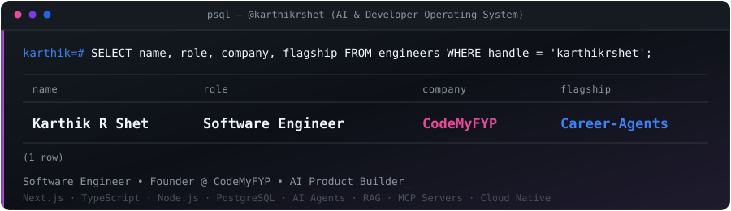
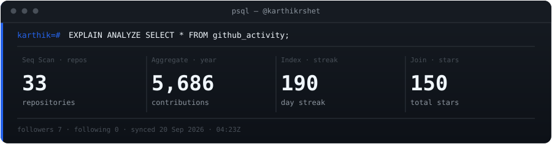
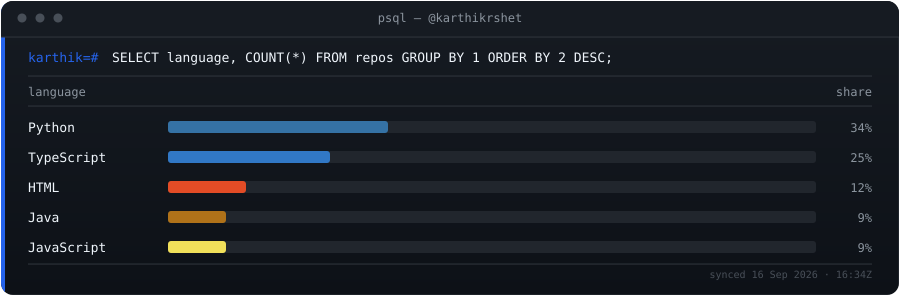
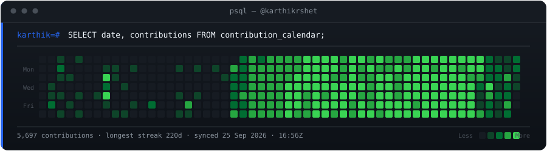

<div align="center">


<p>
<a href="https://github.com/karthikrshet">

</a>
</p>


<br /><br />

<a href="https://karthikrajeshshet.vercel.app"></a>
<a href="mailto:kartikrshet@gmail.com"></a>
<a href="https://www.linkedin.com/in/karthik-rajesh-shet"></a>
<a href="https://github.com/karthikrshet"></a>
<a href="https://leetcode.com/u/karthikrshet/"></a>
<a href="https://www.npmjs.com/package/career-agents"></a>
<a href="https://github.com/sponsors/karthikrshet"></a>

<br /><br />



<br /><br />


<br /><br />





</div>

---

# 🚀 About Me

I'm a **Software Engineer, AI Engineer, and Founder** passionate about building production-grade AI applications, agentic workflows, scalable developer tools, distributed backend systems, and career technology.

Currently focused on:

- 🚀 Building & Scaling **Career-Agents** (146+ Open Source AI Agents & MCP Server)
- 🏢 Leading & Expanding **CodeMyFYP** (EdTech SaaS & AI Software Solutions)
- 🤖 Engineering **Agentic AI & RAG Systems** using Next.js, Node.js, Python & LLM APIs
- 🌍 Growing open-source communities & developer ecosystems
- 💼 Mentoring engineers & helping developers accelerate their careers

### ⚡ Quick Facts

- 🎓 **MCA Graduate** (Specialization in AI & ML)
- 💻 **Full Stack & AI Engineer** (TypeScript, Next.js, Python, PostgreSQL, Redis, Docker)
- 🚀 **Founder & Lead Engineer** @ CodeMyFYP
- 🤖 **Creator** of 146+ AI Agent workflows & MCP Servers
- 📊 **284 Solved on LeetCode** with 97.8% Acceptance Rate
- 📍 **Bengaluru, Karnataka, India**

---

# 🌟 Flagship Project — Career-Agents

## ⚡ The Open Source Career Operating System

**Career-Agents** is an open-source AI platform, CLI, and Model Context Protocol (MCP) server that empowers students, developers, and professionals to optimize resumes, prepare for interviews, analyze market match, and navigate career paths with specialized AI agents.

[](https://www.npmjs.com/package/career-agents)
[](https://www.npmjs.com/package/career-agents)
[](https://github.com/karthikrshet/Career-Agents)
[](https://github.com/karthikrshet/Career-Agents)

### ✨ Highlights

✅ **146+ Specialized AI Career Agents** across 19 divisions  
✅ **Model Context Protocol (MCP) Server** for Claude Desktop, Cursor & Windsurf  
✅ **ATS Resume Studio & Builder** with real-time scoring engine  
✅ **Job Match Intelligence & Resume Parsing**  
✅ **Company Interview Tracks & Knowledge Graph**  
✅ **Global CLI & Published NPM Package**  

```bash
# Global Install
npm install -g career-agents

# Quick Commands
career-agents doctor
career-agents assess
career-agents recommend
career-agents company google
career-agents path ai-engineer
career-agents resume templates
```

🔗 **Repository:** [github.com/karthikrshet/Career-Agents](https://github.com/karthikrshet/Career-Agents)  
📦 **NPM Package:** [npmjs.com/package/career-agents](https://www.npmjs.com/package/career-agents)  

---

# 🚀 Featured Projects

| Project | Description | Tech Stack | Repository |
| :--- | :--- | :--- | :--- |
| 🎯 **Career-Agents** | Open-source Career Operating System with 146+ AI Agents, MCP server & CLI | Next.js • TypeScript • Python • MCP • OpenAI • Gemini • Docker | [GitHub ↗](https://github.com/karthikrshet/Career-Agents) |
| 🤖 **CareerByte AI** | AI-powered career copilot for job discovery, ATS optimization & application tracking | Next.js • TypeScript • PostgreSQL • Prisma • OpenAI • Gemini | [GitHub ↗](https://github.com/karthikrshet/CareerByte-AI) |
| 📈 **AdIntel AI** | AI campaign intelligence platform for media buyers (Meta, Google, TikTok, Taboola) | Next.js • TypeScript • PostgreSQL • OpenAI • Analytics Pipelines | [GitHub ↗](https://github.com/karthikrshet/adintel.ai) |
| 📱 **GPU-Insight-AI** | Android GPU monitoring & AI diagnostics platform with real-time hardware telemetry | Kotlin • Jetpack Compose • Gemini AI • Room • Material 3 | [GitHub ↗](https://github.com/karthikrshet/GPU-Insight-AI) |
| 🛡️ **auditforge-ai** | AI-powered website auditor for SEO, Performance, Accessibility & AI Visibility | Next.js • TypeScript • Gemini AI • Web Security Pipelines | [GitHub ↗](https://github.com/karthikrshet/auditforge-ai) |
| 🧠 **LearnOS-ai** | AI-powered Learning OS generating personalized roadmaps, projects & workspaces | Next.js • TypeScript • PostgreSQL • OpenAI • Gemini | [GitHub ↗](https://github.com/karthikrshet/LearnOS-ai) |
| 🔍 **CodeRAG** | Production-ready AST-parsed RAG engine for codebases with precise citations | Python • Tree-Sitter • PostgreSQL • Embeddings • LLMs | [GitHub ↗](https://github.com/karthikrshet/coderag) |
| 🦅 **Kestrel** | Autonomous AI software engineering platform with multi-agent orchestration | Next.js • Fastify • TypeScript • Redis • BullMQ • PostgreSQL | [GitHub ↗](https://github.com/karthikrshet/kestrel) |
| 🤖 **JobPilot AI** | Personal AI job copilot for automated discovery, match scoring & interview prep | Next.js 15 • TypeScript • PostgreSQL • Redis • BullMQ • Gemini | [GitHub ↗](https://github.com/karthikrshet/jobpilot-ai) |
| 💳 **PayGateway** | Stripe-inspired payment gateway simulation with row-level locking & idempotency | Node.js • Express • PostgreSQL • React 18 • JWT • Docker | [GitHub ↗](https://github.com/karthikrshet/payment-gateway) |

---

# 💻 Tech Stack

## 🗣️ Languages

<p>

</p>

## 🎨 Frontend

<p>

</p>

## ⚙️ Backend & Systems

<p>

</p>

- REST APIs • GraphQL • Microservices • Idempotent APIs • Event-Driven Architecture • BullMQ • Webhooks

## 🗄️ Databases & Storage

<p>

</p>

## ☁️ Cloud, DevOps & Infrastructure

<p>

</p>

## 🤖 AI & Machine Learning

- **LLM APIs:** OpenAI API, Gemini API, Claude API
- **AI Architectures:** Agentic AI, Multi-Agent Orchestration, RAG Systems, Vector Search
- **Protocols:** Model Context Protocol (MCP) Servers, Structured Tool Calling, Prompt Engineering

## 🛠️ Developer Tools

<p>

</p>

- Prisma • Jest • Docker • Claude Code • Cursor • Windsurf

---

# 📚 Public Repositories

**Selected repositories** · refreshed every 12 hours via GitHub API

<!-- PROJECTS_START -->
| Project | Description | Stack | ★ |
| :-- | :-- | :-- | --: |
| **[Career-Agents ↗](https://github.com/karthikrshet/Career-Agents)** | The Open Source Career Operating System. 146+ AI Agents, Resume Intelligence & MCP Server. | TypeScript | 11 |
| **[Karthik-LeetCode-Solutions ↗](https://github.com/karthikrshet/Karthik-LeetCode-Solutions)** | Optimized Java solutions to LeetCode coding challenges with detailed problem explanations. | Java | 1 |
| **[open-ai-portfolio ↗](https://github.com/karthikrshet/open-ai-portfolio)** | Open-source AI Engineer portfolio template with project case studies & terminal UI. | TypeScript | 1 |
| **[GPU-Insight-AI ↗](https://github.com/karthikrshet/GPU-Insight-AI)** | Open-source Android GPU monitoring & AI diagnostics platform built with Kotlin & Gemini AI. | Kotlin | 1 |
| **[auditforge-ai ↗](https://github.com/karthikrshet/auditforge-ai)** | AI-powered website auditing platform analyzing SEO, Performance & AI Visibility. | TypeScript | 1 |
| **[LearnOS-ai ↗](https://github.com/karthikrshet/LearnOS-ai)** | AI-powered Learning OS generating personalized roadmaps, projects & AI workspaces. | TypeScript | 0 |
| **[coderag ↗](https://github.com/karthikrshet/coderag)** | Production-ready RAG for codebases using AST parsing, hybrid search & LLMs. | Python | 0 |
| **[kestrel ↗](https://github.com/karthikrshet/kestrel)** | Open-source autonomous software engineering platform & multi-agent orchestrator. | TypeScript | 1 |
| **[jobpilot-ai ↗](https://github.com/karthikrshet/jobpilot-ai)** | Personal AI job copilot discovering jobs, ranking match scores & generating applications. | TypeScript | 1 |
| **[CareerByte-AI ↗](https://github.com/karthikrshet/CareerByte-AI)** | Open-source AI Career Copilot for job discovery, ATS optimization & interview prep. | TypeScript | 2 |
| **[adintel.ai ↗](https://github.com/karthikrshet/adintel.ai)** | AI-powered campaign intelligence platform for media buyers (Meta, Google, TikTok). | TypeScript | 0 |
| **[url-shortener-telegram-bot ↗](https://github.com/karthikrshet/url-shortener-telegram-bot)** | Telegram URL Shortener Bot with click tracking and analytics. | Python | 0 |
| **[forage-midas-JPMorgan ↗](https://github.com/karthikrshet/forage-midas-JPMorgan)** | JPMorgan Chase & Co. Advanced Software Engineering Simulation | Java | 1 |
| **[backend-engineer-portfolio ↗](https://karthikrshet.github.io/backend-engineer-portfolio/)** | — | HTML | 1 |
| **[payment-gateway ↗](https://payment-gateway-frontend.up.railway.app/landing)** | — | JavaScript | 2 |
| **[portfolio ↗](https://karthikrshet.github.io/portfolio/)** | Karthik Rajesh Shet Portfolio | HTML | 2 |
| **[student-result-management-system ↗](https://github.com/karthikrshet/student-result-management-system)** | Web-based result management platform for schools and colleges. | PHP | 3 |
| **[Nexora-A-Multi-Utility-Web-Portal-with-Real-Time-Usage-Tracking-and-AI-Integration ↗](https://github.com/karthikrshet/Nexora-A-Multi-Utility-Web-Portal-with-Real-Time-Usage-Tracking-and-AI-Integration)** | Multi-utility productivity portal with real-time usage tracking & AI. | JavaScript | 2 |
| **[ConvertX-All-in-One-Converter ↗](https://karthikrshet.github.io/ConvertX-All-in-One-Converter/)** | ConvertX is a modern, responsive unit & currency converter built with HTML, CSS, and JavaScript. It support… | CSS | 2 |
| **[Play-With-Code ↗](https://karthikrshet.github.io/Play-With-Code/)** | Play-With-Code is a lightweight, browser-based coding platform designed to help users write, test, and inte… | HTML | 2 |
| **[Weather ↗](https://karthikrshet.github.io/Weather/)** | online Weather Dashboard | JavaScript | 2 |
| **[Gaming-hub ↗](https://karthikrshet.github.io/Gaming-hub/)** | offline gaming platform | HTML | 2 |
<!-- PROJECTS_END -->

---

# 💼 Professional Experience

### **Founding Software Engineer** — *CodeMyFYP IT & Software Solutions* `2025 – Present`
- Architected production-grade AI applications and backend services integrating LLM APIs, cloud-native architectures, REST APIs, PostgreSQL, Redis, and Docker, reducing query latency by 99%.
- Built scalable distributed backend systems supporting multi-agent AI workflows, webhook integrations, and strict authentication with 99.9% uptime.
- Led engineering delivery across 10+ live projects while mentoring 30+ interns and junior engineers following Agile practices.

### **Founding Lead Platform Engineer** — *CodeMyFYP Academy* `2026 – Present`
- Engineered a multi-tenant EdTech SaaS platform serving students, educators, recruiters, and administrators across universities affiliated with VTU and Bangalore University (officially listed on the AICTE National Internship Portal).
- Implemented granular Role-Based Access Control (RBAC) across 5 distinct user roles and integrated secure payment gateways with idempotent transaction handling and webhook reconciliations.

---

# 📊 GitHub Analytics

<div align="center">


<br /><br />


</div>

---

# 🏆 Certifications & Technical Achievements

- 🏅 **LeetCode:** 284+ Problems Solved (70 Easy, 158 Medium, 56 Hard) with a **97.8% Acceptance Rate**
- 🏆 **Sadhana Coding Contests:** 6-Time Winner & 3-Time Runner-Up in competitive algorithmic contests
- 📦 **Open Source Maintainer:** Maintainer of `career-agents` npm package with 3,354+ GitHub contributions across 54 repositories
- 🏢 **AICTE Recognition:** CodeMyFYP Academy is officially listed on the AICTE National Internship Portal
- 📜 **Walmart Global Tech:** Advanced Software Engineering Job Simulation (2026)
- 📜 **JPMorgan Chase & Co:** Software Engineering Job Simulation (2026)
- 📜 **Skyscanner:** Front-End Software Engineering Job Simulation (2026)

---

# 🎓 Education

| Degree | Specialization / Focus | Institution | Duration |
| :--- | :--- | :--- | :--- |
| **Master of Computer Applications (MCA)** | Specialization in AI & ML | Surana College (Autonomous), Bangalore University | 2023 – 2025 |
| **Bachelor of Computer Applications (BCA)** | Computer Applications & Software Dev | Global College of Management, Karnataka University | 2020 – 2023 |

---

# 🎯 2026 Goals

- ⭐ **1,000+ GitHub Stars** on Career-Agents
- 📦 **10,000+ NPM Downloads** across career tooling packages
- 🤝 Build a vibrant global open-source community around AI career agents
- 🌐 Launch **CareerAgents.dev**
- 🚀 Scale CodeMyFYP into a premier platform for developers and students

---

# ⚡ Recent Activity

Recent public GitHub activity, refreshed automatically:

<!-- CONTRIB_START -->
<ul>
  <li><b>Aug 05, 2026</b> &nbsp;Pushed to <code>main</code> on <b>Career-Agents</b> &nbsp;&middot;&nbsp; <a href='https://github.com/karthikrshet/Career-Agents'>repo</a></li>
  <li><b>Aug 05, 2026</b> &nbsp;Pushed to <code>main</code> on <b>Karthik-LeetCode-Solutions</b> &nbsp;&middot;&nbsp; <a href='https://github.com/karthikrshet/Karthik-LeetCode-Solutions'>repo</a></li>
  <li><b>Aug 05, 2026</b> &nbsp;Pushed to <code>main</code> on <b>Career-Agents</b> &nbsp;&middot;&nbsp; <a href='https://github.com/karthikrshet/Career-Agents'>repo</a></li>
  <li><b>Aug 05, 2026</b> &nbsp;Pushed to <code>main</code> on <b>Karthik-LeetCode-Solutions</b> &nbsp;&middot;&nbsp; <a href='https://github.com/karthikrshet/Karthik-LeetCode-Solutions'>repo</a></li>
  <li><b>Aug 05, 2026</b> &nbsp;Pushed to <code>main</code> on <b>Career-Agents</b> &nbsp;&middot;&nbsp; <a href='https://github.com/karthikrshet/Career-Agents'>repo</a></li>
</ul>
<!-- CONTRIB_END -->

---

# 🤝 Let's Connect

<div align="center">

<a href="https://www.linkedin.com/in/karthik-rajesh-shet">

</a>
<a href="https://github.com/karthikrshet">

</a>
<a href="mailto:kartikrshet@gmail.com">

</a>
<a href="https://karthikrajeshshet.vercel.app">

</a>

<br /><br />

### 🚀 Building software & AI tools that empower people to learn, build, and grow.

<sub>karthikrshet · &copy; 2026 Karthik Rajesh Shet. All Rights Reserved.</sub>

</div>
